# The BluePrint Gym: Under the Hood 🏋️‍♂️💻

Welcome to the engineering deep dive of the BluePrint Gym app! We're going to peel back the layers and look at how this thing ticks. It's not just a checklist; it's a resilient, offline-first machine.

## 🏗️ The Architecture: "The Island Survivor"

Imagine you're stranded on a desert island with your iPhone. You still want to do your workout, right? That was the core philosophy behind this architecture.

**The Setup:**
We built this as a **Progressive Web App (PWA)**.
*   **The "Island" (Client-Side)**: logic lives entirely in your browser. There is no backend server calculating your reps or storing your history.
*   **The "Supply Drop" (Static Hosting)**: We use **GitHub Pages** to deliver the initial files (HTML, CSS, JS). Once they land on your phone, the connection can result cut, and the app keeps running.

### System Overview

```mermaid
graph TD
    User((User 🏋️‍♂️))
    subgraph "iOS Device (Client)"
        Browser[Safari / PWA Shell]
        UI[User Interface]
        Logic[app.js Logic]
        Cache[Service Worker Cache]
        DB[(localStorage)]
    end
    subgraph "The Cloud"
        GH[GitHub Pages]
    end

    User <-->|Interacts| UI
    UI <--> Logic
    Logic <-->|Read/Write| DB
    Logic <-->|Fetch Code| Cache
    Cache <-->|Updates| GH
    
    style DB fill:#f9f,stroke:#333,stroke-width:2px
    style GH fill:#bbf,stroke:#333,stroke-width:2px
```


**How components connect:**
1.  **`index.html`**: The skeleton. It loads the muscle (`app.js`) and the skin (`styles.css`).
2.  **`app.js`**: The brain. It manages the state (what you checked off), handles interactions (clicks, swipes), and talks to the persistent memory (`localStorage`).
3.  **`service-worker.js`**: The gatekeeper. It intercepts network requests. If you're offline, it serves files from its cache so the app loads instantly.

## 🛠️ Technologies Used

-   **Vanilla JavaScript**: No React, no Vue, no bloated frameworks.
    -   *Why?* Speed and simplicity. For an app this size, a framework is like bringing a semi-truck to pick up groceries. Vanilla JS keeps the bundle size tiny (~18KB) and performance blazing fast.
-   **CSS Variables**: For that sweet, consistent theming (Dark Mode vibes).
-   **LocalStorage API**: Our "Database". It's a simple key-value store built into the browser.
-   **Service Workers**: The magic behind "offline-capable".

## 🧠 Technical Decisions & "Why did we do that?"

### 1. "Database" in the Browser (`localStorage`)
*   **The Decision**: We chose `localStorage` over a cloud database (like Firebase).
*   **The Why**: Privacy and speed. Your workout data is *yours*. It lives on your phone. Plus, reading from local memory is instant. No loading spinners.
*   **The Trade-off**: If you lose your phone, you lose your data. (We accepted this risk for simplicity).

### 2. State Management: The "Truth" Arrays
*   **The Decision**: We used global variables (`completed`, `weights`, `history`) as the "Single Source of Truth" and re-rendered the UI whenever they changed.
*   **The Why**: This mimics React's philosophy ("UI is a function of State") without the library overhead.
    *   *Example*: When you swap an exercise, we update the `workoutState` object first. Then we call `renderApp()`. The UI automatically reflects the change. We never try to manually hack the DOM (like `element.innerText = '...'`) without updating state first.

### Data Flow Loop


### 3. The "Mutable" Exercise List
*   **The Decision**: We moved from `const exercises = [...]` to `let exercises = [...]`.
*   **The Lesson**: Originally, we hardcoded exercises. But then you wanted to rename them. **Hardcoding is a trap.** By making the list dynamic and mergeable with saved data, we empowered the user without rewriting the code every time.

## 🐛 War Stories: Bugs & Lessons Learned

### The "Ghost Data" Crash (The iOS Issue) 👻
*   **The Bug**: You'd do a workout, switch apps, come back, and... *poof*. Data gone.
*   **The Cause**: iOS is aggressive. If an app is in the background, iOS might kill it to save battery. Since we only saved data when you clicked "Save Workout", anything in progress was held in RAM (volatile memory). When iOS killed the app, RAM was cleared.
*   **The Fix**: **Auto-save on every change.** Now, every time you check a box or type a weight, `saveProgress()` writes to `localStorage`.
*   **The Lesson**: **Never trust the user to save.** The best interface is one that saves you from yourself. Treat memory (RAM) as temporary and hostile.

### The "Zombie Update" 🧟‍♂️
*   **The Bug**: We pushed code to GitHub, but your phone kept showing the old version.
*   **The Cause**: The Service Worker! It's designed to cache files for offline use. It was doing its job *too well*, serving the old cached `app.js` instead of fetching the new one.
*   **The Fix**: Versioning. We changed `CACHE_NAME` from `v7` to `v8`. This forced the browser to dump the old cache and grab the fresh code.
*   **The Lesson**: **Cache invalidation is one of the two hardest problems in computer science.** (The other is naming things). Always have a strategy to bust your cache.

### The "Deployment Limbo" ☁️
*   **The Bug**: We pushed to `main`, but nothing happened.
*   **The Cause**: GitHub Pages was listening to the `gh-pages` branch, not `main`. We were shouting into the void.
*   **The Lesson**: **Know your pipeline.** It's not enough to write code; you must know how it ships. We documented this in `DEPLOYMENT.md` so we never forget again.

### Deployment Pipeline
```mermaid
gitGraph
    commit id: "Initial"
    branch gh-pages
    checkout main
    commit id: "Dev Work"
    commit id: "Bug Fix"
    checkout gh-pages
    merge main tag: "Deploy"
    checkout main
    commit id: "New Feature"
```
*Visualizing the flow: Work happens on `main`. Deploys happen only when we merge/push to `gh-pages`.*

## 🚀 How Good Engineers Think
1.  **Fail Safely**: We didn't just fix the crash; we assumed crashes *will* happen and made sure data survives them.
2.  **User First**: The "Swap" feature wasn't in the original spec. But we realized rigid plans break in the real world (sometimes the Squat Rack is taken!). Good software adapts to the user, not the other way around.
3.  **Simplicity Wins**: We could have used a heavy database or framework. We didn't. We solved the problem with the simplest tool available. That is the mark of engineering maturity.
